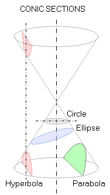
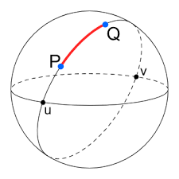

## Let Me Be Sphere:
### Interactive Visualizations of Projective Varieties in Spherical Geometry
Katie Hess, Charlie Ruppe, and Jake Schaefer

Note: Read title and names

---

## Overview
* Projective Space
* Spherical Geometry
* New Images and Visualizations
* How To Make Beautiful Images Using Math

Note: We will begin by explaining what we mean by projective space and spherical
geometry, and how they relate.

Then we will show you some of our images and interactive visualizations of
objects in spherical geometry and projective space.

Finally we will teach you how to make your own pictures of these objects using
some math and a little cleverness.

---

# Projective Space

---

From Euclid's Elements Book 1.

"Parallel lines do not meet."

Today we will disobey Euclid and consider:

what if we allowed parallel lines to meet *somewhere*.

---

### Motivation: Perspective In Art
Since the Renaissance, artists have used "vanishing points" to represent
3-dimensional geometry on a flat canvas.

Parallel lines are drawn meeting at a shared vanishing point which depends on the
direction they are headed.

Note: The picture circa 1423 is Masolino da Panicale's "St. Peter Healing a
Cripple and the Raising of Tabitha," the earliest extant artwork known to use a
consistent vanishing point.

Parallel lines are continued and found to meet at the vanishing point whose
position depends on the direction of the parallel lines.

Different direction in the scene and you get a different vanishing point.

---

The painter colors each point of the canvas by following his line of sight until
it hits an object.

The line for the vanishing point never hits the scene, so the vanishing point is
placed infinitely far away.

We include these points at infinity into our space to get *projective geometry*.

Note:
*click the photo*

You can trace the painters line of sight through the page and out into the scene

The line for the vanishing point never hits the scene so the vanishing point
could only be placed infinitely far away.

We include these points at infinity into our scene to get projective geometry.

At this point your calculus teacher would protest because I
am using infinity like a real distance that can exist.

If you suspend your discomfort I will tell you how a concrete way of
representing these points at infinity.

---

Points of the *projective plane* can be represented using the artistic method of
perspective projection.

**Fact**: In the projective plane *any* two lines intersect at exactly one point.

Note:
Points in the ground plane give you a unique point in the image plane by
following the line of sight to O.

Even our vanishing points which don't strictly exist in the scene can be represented
on the image plane.

This diagram shows that even parallel lines must meet at a point when
represented on the image plane.

This highlights our first property of the projective plane. Any two lines
intersect at exactly one point.

---

Some nice theorems in projective space:

  

    <ul>
      <li><strong>Bezout's Theorem:</strong> The number of intersection points of two polynomials is the product of their degrees.</li>
      <li>All smooth <strong>conic sections</strong> (ellipses, parabolas, hyperbolas) are equivalent in projective space.</li>
      <li><strong>Duality:</strong> You can swap the words "line" and "point" in any theorem to get a new valid theorem.</li>
    </ul>
  

  

    
    
  

Note:

There are lots of nice results that are only true in projective space such as
Bezout's theorem which counts the number of intersection points of curves
according to their degree.

In projective space we find that all smooth conic sections are equivalent.

Every theorem in projective space has a dual where you swap the words "line" and
"point".

We don't have time in this presentation to explain how all of this works.  But
know that projective space pops up in important ways across math and even
physics.

---

Using the artistic model of projective space shown before we are unable to
represent all points.

**Problem**: We can't use a point on the image plane to represent the point directly below $O$.

Note:
But back to our model of projective space.

We run into a problem when we try and represent a point directly below O. The
line of sight doesn't intersect the image plane.

In fact in the way it's shown here we aren't representing points behind O
either.

---

### Sphere Model of Projective Space

Take the line going from the Eye to some point $P$ on the plane.  The intersection
of that line and the sphere gives us a representative point.

Note:

---

**Problem**: Two lines must intersect in just one point!

To fix this we will identify each point on the sphere with its antipode.
Considering both to be two representatives of the same point.

Now points on the sphere above the $Z=0$ plane also have a meaning, given by
their antipode.

Note:

It looks like the parallel lines are intersecting in two places.

We fix this by identifying antipodal points.

A mathematician might say we are glueing the sphere to itself, but there is no
good way to physically do this in three dimensions.

For the experts in the room, I've just defined a 2 to 1 covering map from the
2-sphere to the real projective plane.

---

So far we've been working with 2D projective geometry, the projective plane.

It turns out you this same construction works for 3D projective space, except
now we have to use a hypersphere living in 4D space.

<figure style="margin-top: 20px">

<figcaption style="font-size: 0.6em; margin-top:-20px">
The direct projection of the hypersphere onto $\mathbb R^3$.
</figcaption>
</figure>

---

# Spherical Geometry

---

### Geodesics on a Sphere

In Euclidean flat space, the shortest path between two points is a straight line.

But we must redefine this notion if we restrict ourselves to the surface of a sphere.

Note: 

In order to model projective space using a sphere, we need to understand the geometry of living on the sphere itself.
In Euclidean flat space, the shortest path between two points is a straight line.
But if we must find this path given that we are not allowed to leave the surface of the sphere we must redefine distance to be measured along the surface
meaning that the shortest paths between two points, or geodesics, are no longer ordinary straight lines, they are the arcs of great circles, with a great circle defined as the intersection of a plane through the origin of the sphere with the sphere itself, so the equator is a great circle, lines of longitude are great circles. 

and actually in spherical geometry, light rays themselves follow geodesics, so every ray in our graphics visualizations are moving along great circles in s3

---

### From $S^2$ to $S^3$

The 3-sphere lives in four dimensions, so our intution for it comes via analogy

Geodesics are still great circles, two geodesics will converge at the antipodal point, and there is no infinity to escape to.

Note:

Everything I’ve just said about the 2-sphere also works one dimension higher. So if we think of the 2 sphere as a ball living in 3 dimensional space, then the 3 sphere lives in four-dimensional space, and we can’t necessarily see it directly right in front of us like you can see a ball in front of you, but we can draw analogies to how things work on the 2 sphere and reason how things would work were we to live on the 3-sphere. 

The most important property to us is that if you continue to travel along a geodesic, you don’t go off to infinity.
You eventually reach the antipodal point, the exact opposite point to your starting point on the sphere, and then if you keep going you return to where you started.
So spherical geometry is compact you cannot escape or run off . 
And this aligns really well with what properties we want to help us visualize projective space, because if we send out two separate geodesics that seem like they would naturally diverge , they will actually converge at the antipodal point, and what we once thought of as infinity is simply where straight lines in our new universe come back together

this is an extrinsic visualization of the hypersphere and its rotations but we are going to be doing intrinsic visualization so living in the space

---

### The Earth in the $S^3$ Geometry

<iframe width="1000" height="600" frameborder="0" src="earthdemo.html" allowfullscreen></iframe>

Note:

So what we see in this visualization is the earth moving along a geodesic in s3, as we remain at a fixed point. 
as it approaches it of course grows larger in our view, and we are actually able to see more of it than we would in euclidean space, as our space has positive curvature.

alright now we've entered the earth

and now the earth is actually behind us but it remains visible since light rays are allowed to travel all the way around the sphere we can still see it, it's just oriented upside down 

when the sphere reaches the antipodal point it actually takes up our entire screen, and this is because the object is now the same distance from us in every direction so every light ray we emit is hitting it 

so as it passes the antipode it appears to wrap around us and the orientation flips

and now it's coming back towards us, but it's actually shrinking because it's smallest size is pi/2 radians away from us, at the equator

and now we see it naturally coming back around the sphere towards us again

---

# New Images and Visualizations

---

## Cubic Surface With 27 Lines

<iframe style="width: 100%; aspect-ratio: 16/8; border: none; margin: 0;" src="cubic_demo/index.html"></iframe>

The coefficient minimap shows where the surface becomes singular and the
topology changes.

---

---

---

## Degree 4 Surface Containing a Line

<iframe style="width: 100%; aspect-ratio: 16/8; border: none; margin: 0;" src="quartic_demo/index.html"></iframe>

A plane containing the line intersected with the surface gives a degenerate
degree 4 curve of a line and a degree 3 curve.

Note:
To the experts in the room, this is a picture of an elliptic K3 surface, meaning
the surface is an elliptic fibration over $\mathbb P^1$.

What you’re seeing is a real quartic surface inside the 3-sphere, defined implicitly by a homogeneous degree-four polynomial in four variables. The polynomial is built so that it always contains a fixed line, which appears here in blue. So algebraically, we’re looking at a 4-parameter family of quartic surfaces in projective three-space, each one containing the same line.
Now we take the pencil of planes that pass through that line. Each plane cuts the quartic in a degree-four curve, but because the line is already contained in the surface, the intersection splits into that fixed line together with a cubic curve.  At special angles, the cubic degenerates and that’s the moment where you see the pink intersection curve change type. So visually, this animation is showing a pencil of elliptic curves living on a quartic surface.

---

---

# How To Make Beautiful Images Using Math

[[ Quickly explain the problem of rendering]]
[[ Explain ray tracing/raymarching with an SDF and then say what our naive
approximate SDF is with a code block and LaTeX formula]]

[[ If there is time we go into Descartes Method in Berntein Basis]]

---
## Rendering

We pretend each pixel on our computer is looking along a tiny line of sight. 

Rendering means choosing what (color) we see at every single pixel from our POV

### The Problem

How can we quickly figure out what our camera sees first along each pixel-direction and do it one-million-times fast?

---
## Ray Tracing in Brief
1. Shoot a ray out of the lens of the camera 
2. Using an SDF, trace the ray's path until it hits an object
3. Color the pixel using that hit point
4. Use information from the geometry to create cool effects!

Note:
Just like our eyes!
(line of sight) *whip noise*
Signed distance function checks if we are outside or inside an object. 
---

## But how to fast? SDF

Approximate! Dont solve each intersection exactly, we use a signed distance function

Tells us how far we are, and in what direction, from an object.

In spherical geometry, we use a local estimate to tell us about our geometry

Note:
Use it to tell us how much we can move along our path safely (fawr -> big step, near -> smwall stwep)
In our spherical/projective world, rays may not be straight, but are geodesics, yet marching logic is identical...step forward using a local distance estimate.

---

# *Fein.*

Any questions?

[[this slide should include some things to make asking questions easier, perhaps
formulas, diagrams, or a slideshow of nice renders we've made]]

---

[[this is old stuff]]

### A better way to view $\mathbb{P^2}$
discuss the double cover from S^2

<!-- We use data-src instead of src attribute to enable --
  -- lazy-loading by reveal.js -->
<iframe data-src="example.html"></iframe>

